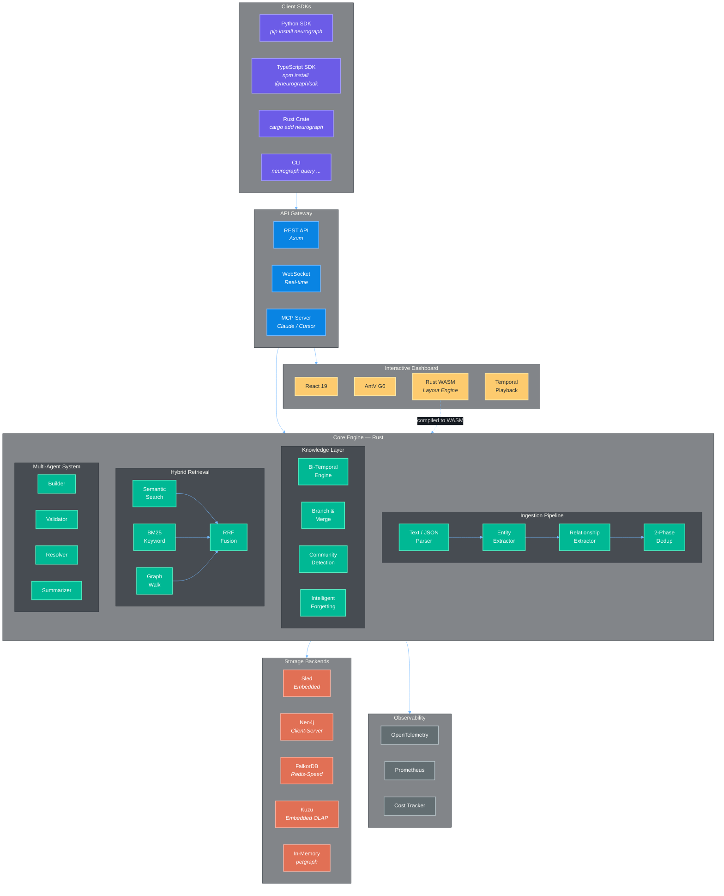

<p align="center">
  
</p>

<p align="center">
  <a href="https://crates.io/crates/neurograph"></a>
  <a href="https://pypi.org/project/neurograph/"></a>
  <a href="https://www.npmjs.com/package/@neurograph/sdk"></a>
  <a href="https://ghcr.io/neurographai/neurograph"></a>
  <a href="https://docs.rs/neurograph"></a>
</p>

<p align="center">
  <a href="https://github.com/neurographai/neurograph/actions/workflows/ci.yml"></a>
  <a href="https://codecov.io/gh/neurographai/neurograph"></a>
  <a href="https://scorecard.dev/viewer/?uri=github.com/neurographai/neurograph"></a>
  <a href="https://github.com/neurographai/neurograph/blob/main/LICENSE"></a>
</p>

<p align="center">
  <a href="https://github.com/neurographai/neurograph/stargazers"></a>
  <a href="https://github.com/neurographai/neurograph/network/members"></a>
  <a href="https://github.com/neurographai/neurograph/issues"></a>
  <a href="https://github.com/neurographai/neurograph/discussions"></a>
</p>

---

# NeuroGraph

> A Rust-powered temporal knowledge graph engine with interactive visualization, built for AI agents that need to remember, reason, and forget.

NeuroGraph is an open-source knowledge graph engine that treats **time as a first-class dimension**. Every fact has a validity window, every query can time-travel, and the graph can branch like Git. It's designed to be the memory layer for AI agents — from personal assistants to multi-agent research systems.

<br/>

## Architecture



<br/>

<!-- Tech Stack -->
<p align="center">
  <b>Core</b><br/>
  
  
  
  
</p>
<p align="center">
  <b>Storage</b><br/>
  
  
  
  
  
</p>
<p align="center">
  <b>Frontend</b><br/>
  
  
  
  
</p>
<p align="center">
  <b>AI / ML</b><br/>
  
  
  
  
</p>
<p align="center">
  <b>Infrastructure</b><br/>
  
  
  
  
</p>

---

## Quick Start

```python
from neurograph import NeuroGraph

ng = NeuroGraph()

# Ingest knowledge
await ng.add("Alice joined Anthropic as a research scientist in March 2026")
await ng.add("Bob moved from Google to OpenAI in January 2026")

# Query with graph-powered RAG
result = await ng.query("Where does Alice work?")
print(result.answer)  # "Anthropic"

# Time travel
past = await ng.at("2025-12-01")
result = await past.query("Where does Bob work?")
print(result.answer)  # "Google"

# Branch reality
await ng.branch("what-if")
await ng.add("Alice leaves Anthropic for DeepMind")
diff = ng.diff_branches("main", "what-if")

# Open interactive dashboard
await ng.dashboard()  # localhost:7777
```

---

## Install

```bash
# Rust
cargo install neurograph

# Python
pip install neurograph

# Node / TypeScript
npm install @neurograph/sdk

# Docker (API + Dashboard)
docker run -p 8000:8000 -p 3000:3000 ghcr.io/neurographai/neurograph

# Docker Compose (full stack)
docker compose up
```

<details>
<summary><b>Build from source</b></summary>

Prerequisites: Rust 1.82+, Node.js 18+

```bash
git clone https://github.com/neurographai/neurograph.git
cd neurograph
cargo build --release
cd dashboard && npm install && npm run dev
```

</details>

---

## Feature Status

> **Legend:** `Stable` = production-ready, API stable | `Beta` = functional, breaking changes possible | `Experimental` = proof-of-concept | `Planned` = on roadmap

| Capability | Status |
|---|---|
| **Temporal Knowledge Graph** — Bi-temporal facts with `valid_from` / `valid_until` | **Stable** |
| **Community Detection** — Louvain/Leiden in native Rust | **Stable** |
| **Hybrid Retrieval** — Semantic + BM25 + graph walk with RRF fusion | **Stable** |
| **Cost-Aware Routing** — Auto-selects cheapest query strategy within budget | **Stable** |
| **Zero Config** — `pip install neurograph`, 3 lines, works. No API key needed. | **Stable** |
| **Interactive Dashboard** — Browser graph explorer (G6 + Rust WASM layouts) | **Beta** |
| **Graph Version Control** — Branch, diff, merge knowledge graphs | **Beta** |
| **Temporal Playback** — Timeline slider to scrub through knowledge history | **Beta** |
| **Think-While-You-Watch** — Real-time reasoning animation on graph | **Experimental** |
| **Intelligent Forgetting** — Importance-based decay and compression | **Experimental** |
| **Multi-Agent Graph Building** — Collaborative agents for extraction/validation | **Experimental** |
| **MCP Server** — Claude/Cursor integration via Model Context Protocol | **Experimental** |
| **Python SDK** — Native PyO3 bindings | **Planned** |
| **TypeScript SDK** — WASM-powered browser/Node client | **Planned** |
| **Distributed Sharding** — Scale across multiple nodes | **Planned** |

<details>
<summary><b>Full feature breakdown</b></summary>

### Reasoning and Knowledge

| Feature | Details |
|---------|---------|
| Entity extraction (LLM) | Structured JSON output via OpenAI / Anthropic / Gemini / Ollama |
| Entity extraction (offline) | Regex-based NER fallback — works without any API key |
| Relationship extraction | Automatic from text + manual from structured JSON |
| Multi-hop reasoning | Graph walk + LLM reasoning across connected entities |
| Community detection (Louvain) | Native Rust implementation on petgraph |
| Community detection (Leiden) | Hierarchical with resolution parameter |
| Incremental community updates | k-hop delta recomputation |
| Community summarization | LLM map-reduce with hierarchical rollup |
| Diff-based re-summarization | Update summaries incrementally (~30% token cost vs full regen) |
| Cost-aware query routing | Classifies query, estimates cost per strategy, selects optimal |

### Retrieval and Search

| Feature | Details |
|---------|---------|
| Semantic vector search | Cosine similarity on embeddings (OpenAI / FastEmbed / any provider) |
| BM25 keyword search | Full-text search via tantivy |
| Graph traversal search | Scored BFS/DFS from seed entities |
| Hybrid retrieval | Reciprocal Rank Fusion (RRF) combining all three methods |
| Context assembly | Token-budget-aware prompt building with citations |

### Temporal and Data Management

| Feature | Details |
|---------|---------|
| Bi-temporal model | Every fact has `valid_from` and `valid_until` timestamps |
| Automatic fact invalidation | New contradicting facts invalidate old ones |
| Point-in-time queries | `ng.at("2026-03-15")` returns graph state at that moment |
| Entity history | Full chronological fact chain per entity |
| Temporal diff | `ng.what_changed("2026-01", "2026-06")` |
| Graph branching | Copy-on-write branches for hypothetical scenarios |
| Graph merge | 4 strategies: SourceWins, TargetWins, VerifiedOnly, TemporalMerge |
| 2-phase deduplication | Phase 1: embedding similarity + hash. Phase 2: LLM fallback |

### Visualization (Beta)

| Feature | Details |
|---------|---------|
| Interactive dashboard | `await ng.dashboard()` launches browser UI |
| WebGL/Canvas rendering | G6 engine with multi-layer canvas |
| Force-directed layout | Rust WASM for compute-heavy layouts |
| Temporal playback | Scrub through time — nodes appear/disappear as facts change |
| Community clusters | Color-coded G6 Combos |
| Dark/Light mode | Premium dark theme by default |

### Infrastructure

| Feature | Details |
|---------|---------|
| Embedded database (sled) | Default, zero-config persistent storage |
| In-memory mode | petgraph backend for testing |
| Neo4j driver | Connect to existing instances |
| FalkorDB driver | Redis-speed graph queries |
| Kuzu driver | Embedded analytical graph database |
| REST API | Axum-based, async |
| WebSocket | Real-time graph updates |
| Docker | Multi-stage build, non-root, slim image |
| OpenTelemetry | Distributed tracing + metrics |
| Per-operation cost tracking | Model, tokens, cost USD, latency per call |

</details>

---

## Key Concepts

| Concept | What It Does | Why It Matters |
|---------|-------------|----------------|
| **Bi-Temporal Facts** | Every fact has a validity window (`valid_from`, `valid_until`) | Query what was true at any point in time |
| **Graph Branching** | `ng.branch("hypothesis")` creates a copy-on-write branch | Explore what-if scenarios without corrupting real data |
| **Hybrid Retrieval** | Semantic + BM25 + graph traversal, fused with RRF | Better recall than any single search method |
| **Cost-Aware Routing** | Classifies your query and picks the cheapest strategy that meets quality | Predictable LLM spend |
| **Intelligent Forgetting** | Importance = PageRank + access frequency + recency. Low-importance facts decay. | Graph doesn't grow unbounded |
| **Zero API Key Mode** | Regex NER + local FastEmbed + embedded sled | Fully offline, air-gapped, $0 |

---

## Comparison

> Trade-offs are real. NeuroGraph optimizes for temporal reasoning and Rust-native performance. Other tools may be better fits depending on your use case.

| | NeuroGraph | GraphRAG (Microsoft) | Graphiti (Zep) | Mem0 |
|---|---|---|---|---|
| **Best for** | Temporal reasoning, agent memory | Batch document analysis | Episodic memory | Simple key-value memory |
| **Language** | Rust core, Py/TS wrappers | Python | Python | Python |
| **Temporal model** | Bi-temporal | Static | Edge-based time | Recency only |
| **Query approach** | Hybrid (semantic + BM25 + graph) | Map-reduce over communities | Direct retrieval | Vector similarity |
| **Visualization** | Built-in dashboard (Beta) | External (Gephi) | Neo4j Browser | Standard UI |
| **Offline mode** | Yes (regex NER + local embed) | No (requires LLM) | Requires LLM | Requires API |
| **Community detection** | Rust native (Louvain/Leiden) | Python NetworkX | No | No |
| **Maturity** | Early (pre-release) | Production | Production | Production |

---

## Benchmarks

> All numbers from `cargo bench` on an M2 MacBook Pro (16GB) with default embedded config.
> Reproduce locally: `cd benchmarks && cargo bench`. See [`benchmarks/README.md`](./benchmarks/README.md) for methodology.

| Metric | Result | Notes |
|--------|--------|-------|
| **Query latency (P50)** | ~150ms | Hybrid retrieval, embedded sled |
| **Query latency (P99)** | ~500ms | Includes LLM round-trip for answer generation |
| **Community detection (1k nodes)** | <100ms | Native Rust Louvain |
| **Graph layout (10k nodes)** | <200ms | Rust WASM force-directed |
| **Memory baseline** | ~50MB | Empty graph with sled |
| **Cold start** | <2s | Server ready to accept queries |

These numbers reflect current development builds and will change. We plan to add CI-tracked benchmarks via [Bencher](https://bencher.dev) or [GitHub Actions benchmark tracking](https://github.com/benchmark-action/github-action-benchmark).

---

## API at a Glance

| Operation | Python | Rust |
|-----------|--------|------|
| **Create** | `ng = NeuroGraph()` | `let ng = NeuroGraph::builder().build().await?;` |
| **Ingest** | `await ng.add("Alice joined Anthropic")` | `ng.add_text("Alice joined Anthropic").await?;` |
| **Query** | `await ng.query("Where does Alice work?")` | `ng.query("Where does Alice work?").await?;` |
| **Time travel** | `await ng.at("2025-01-01")` | `ng.at("2025-01-01").await?;` |
| **History** | `await ng.history("alice")` | `ng.history("alice").await?;` |
| **Branch** | `await ng.branch("hypothesis")` | `ng.branch("hypothesis").await?;` |
| **Diff** | `ng.diff_branches("main", "hypothesis")` | `ng.diff_branches("main", "hypothesis")?;` |
| **Search** | `await ng.search("Alice")` | `ng.search("Alice").await?;` |
| **Dashboard** | `await ng.dashboard()` | `ng.serve(7777).await?;` |

---

## Integrations

<details>
<summary><b>LLM Providers</b></summary>

| Provider | Models | Local/Cloud |
|----------|--------|-------------|
| OpenAI | GPT-4o, GPT-4o-mini | Cloud |
| Anthropic | Claude 4, Claude 3.5 Sonnet | Cloud |
| Google Gemini | Gemini 2.0 Flash, Gemini Pro | Cloud |
| Ollama | Llama 3, DeepSeek, Mistral, Phi | Local |
| Any OpenAI-compatible | LM Studio, vLLM, Together AI | Local/Cloud |
| **None (offline)** | **Regex NER + rule-based** | **Local** |

</details>

<details>
<summary><b>Storage Backends</b></summary>

| Backend | Type | Setup |
|---------|------|-------|
| **Sled (default)** | **Embedded** | **None** |
| In-Memory (petgraph) | In-process | None |
| Kuzu | Embedded | None |
| Neo4j | Client-server | Docker |
| FalkorDB | Client-server | Docker |

</details>

<details>
<summary><b>Embedding Providers</b></summary>

| Provider | Models | Local/Cloud |
|----------|--------|-------------|
| **FastEmbed (default)** | **bge-small-en-v1.5** | **Local** |
| OpenAI | text-embedding-3-small/large | Cloud |
| Sentence Transformers | Any HuggingFace model | Local |

</details>

<details>
<summary><b>Observability</b></summary>

| Tool | What's Tracked |
|------|---------------|
| OpenTelemetry | Distributed traces per operation |
| Prometheus | Latency, throughput, cache hit metrics |
| Built-in Cost Tracker | Per-query: model, tokens, USD cost, latency |

</details>

---

## Documentation

- [Architecture](docs/architecture.md)
- [Temporal Engine](docs/temporal.md)
- [Community Detection](docs/community.md)
- [Developer Guide](DEVELOPING.md)
- [Contributing](CONTRIBUTING.md)
- [Security Policy](SECURITY.md)
- [Changelog](CHANGELOG.md)

## Roadmap

See the [issue tracker](https://github.com/neurographai/neurograph/issues) for the full roadmap. High-priority items:

- Native Python SDK (PyO3 bindings)
- TypeScript SDK (WASM-powered)
- MCP server stabilization
- CI-tracked performance benchmarks
- Helm chart for Kubernetes
- Distributed graph sharding

## Contributing

We welcome contributions, especially in areas marked **Experimental** or **Planned** above. See [CONTRIBUTING.md](CONTRIBUTING.md).

```bash
git clone https://github.com/neurographai/neurograph.git
cd neurograph
cargo test --workspace
```

## License

[Apache-2.0](LICENSE)

---

<p align="center">
  <b>Built by <a href="https://github.com/Ashutosh0x">Ashutosh Kumar Singh</a></b>
</p>
