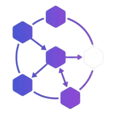
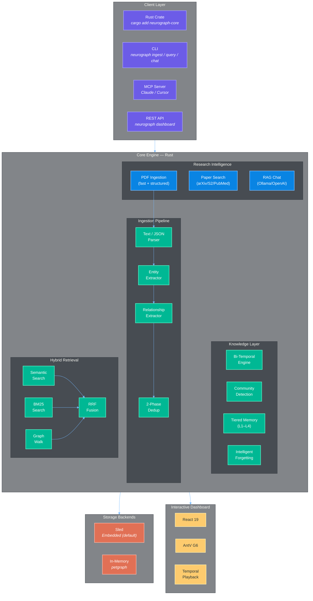

<p align="center">
  
</p>

<p align="center">
  
</p>

<p align="center">
  <a href="https://github.com/neurographai/neurograph/actions/workflows/ci.yml"></a>
  <a href="https://github.com/neurographai/neurograph/blob/main/LICENSE"></a>
  <a href="https://github.com/neurographai/neurograph/stargazers"></a>
  <a href="https://github.com/neurographai/neurograph/issues"></a>
  <a href="https://github.com/neurographai/neurograph/discussions"></a>
</p>

>  **Pre-release software** — NeuroGraph is under active development (`v0.1.0-alpha`). APIs may change. Not yet published to crates.io.


---

# NeuroGraph

> A Rust-powered research paper intelligence platform — ingest PDFs, search across arXiv/Semantic Scholar/PubMed, build temporal knowledge graphs, and chat with your research using AI.

NeuroGraph is an open-source knowledge graph engine that treats **time as a first-class dimension**. Feed it research papers, and it extracts entities, builds a knowledge graph, and lets you query it with natural language. Every fact has a validity window, every query can time-travel, and the graph can branch like Git.


https://github.com/user-attachments/assets/c695117a-ebac-494e-9c13-9e86dbad47df


<br/>

## Architecture



<br/>

<!-- Tech Stack -->
<p align="center">
  <b>Core</b><br/>
  
  
  
  
</p>
<p align="center">
  <b>Frontend</b><br/>
  
  
  
  
</p>
<p align="center">
  <b>AI / LLM</b><br/>
  
  
  
</p>
<p align="center">
  <b>Infrastructure</b><br/>
  
  
</p>
<p align="center">
  <a href="docs/NeuroGraph_Paper.pdf"></a>
  <a href="docs/neurograph_paper.tex"></a>
</p>

---

## Quick Start

```rust
use neurograph_core::NeuroGraph;

#[tokio::main]
async fn main() -> Result<(), Box<dyn std::error::Error>> {
    // Zero config — in-memory, offline, no API key needed
    let ng = NeuroGraph::builder().memory().build().await?;

    // Ingest knowledge (regex NER extracts entities + relationships)
    ng.add_text("Alice joined Anthropic as a research scientist in March 2026").await?;
    ng.add_text("Bob moved from Google to OpenAI in January 2026").await?;

    // Query with hybrid retrieval (semantic + keyword + graph walk)
    let result = ng.query("Where does Alice work?").await?;
    println!("{}", result.answer);       // "Anthropic"
    println!("{:.0}%", result.confidence * 100.0);  // "85%"

    // Time travel — query the graph as it was in the past
    let past = ng.at("2025-12-01").await?;
    let result = past.query("Where does Bob work?").await?;
    println!("{}", result.answer);  // "Google" (before he moved)

    // Entity history — see how facts evolved over time
    let history = ng.entity_history("Bob").await?;
    for rel in &history {
        println!("{}", rel.fact);
    }

    // Community detection — discover clusters of related entities
    let communities = ng.detect_communities().await?;
    println!("Found {} communities", communities.communities.len());

    Ok(())
}
```

### Research Paper Intelligence

```bash
# Ingest a research paper (PDF → structured chunks → knowledge graph)
neurograph ingest --pdf paper.pdf
neurograph ingest --dir ./papers/

# Search across arXiv, Semantic Scholar, and PubMed
neurograph search "attention mechanisms in transformers" --arxiv --s2
neurograph search "CRISPR gene editing" --pubmed --since 2024

# Interactive RAG chat with your knowledge graph
neurograph chat --model ollama:llama3.2

# Launch the dashboard with REST API
neurograph dashboard --port 8000 --open
```

### CLI

```bash
# Install from source
cargo install --path crates/neurograph-cli

# Ingest
neurograph ingest "Alice joined Anthropic in March 2026"
neurograph ingest --file meeting_notes.txt
neurograph ingest --pdf paper.pdf
neurograph ingest --dir ./research_papers/

# Query
neurograph query "Where does Alice work?"
neurograph query "Where did Bob work?" --at "2025-12-01"

# Research Paper Search
neurograph search "transformer architecture" --arxiv --s2 --limit 20
neurograph search "protein folding" --pubmed --since 2023 --sort citations

# Interactive Chat
neurograph chat --model ollama:llama3.2

# Dashboard & API
neurograph dashboard --port 8000 --open
neurograph serve --port 8000

# Explore
neurograph history "Alice"
neurograph communities
neurograph stats

# Benchmark
neurograph bench
```

---

## Install

```bash
# From source (recommended for now)
git clone https://github.com/neurographai/neurograph.git
cd neurograph
cargo build --release

# Install CLI
cargo install --path crates/neurograph-cli

# As a library dependency
# Add to your Cargo.toml:
# [dependencies]
# neurograph-core = { git = "https://github.com/neurographai/neurograph" }
```

> **Coming soon:** `cargo install neurograph` (crates.io), `pip install neurograph` (PyPI), `npm install @neurograph/sdk` (npm). See [Roadmap](#roadmap).

---

## Feature Status

> **Legend:** `Stable` = tested, reliable | `Beta` = functional, API may change | `Alpha` = proof-of-concept | `Planned` = on roadmap

| Capability | Status |
|---|---|
| **Temporal Knowledge Graph** — Bi-temporal facts with `valid_from` / `valid_until` | **Stable** |
| **Community Detection** — Louvain in native Rust | **Stable** |
| **Hybrid Retrieval** — Semantic + keyword + graph walk with RRF fusion | **Stable** |
| **Cost-Aware Routing** — Tracks per-query LLM cost in USD | **Stable** |
| **Zero Config** — In-memory default, works offline with regex NER | **Stable** |
| **PDF Ingestion** — Two-tier parser (fast text + structured academic detection) | **Beta** |
| **Paper Search** — Multi-source aggregator (arXiv, Semantic Scholar, PubMed) | **Beta** |
| **RAG Chat** — Context-aware chat with conversation history | **Beta** |
| **REST API & Dashboard** — Axum-based server with embedded React SPA | **Beta** |
| **Embedding Router** — Ollama, OpenAI, and hash providers with LRU cache | **Beta** |
| **Entity Extraction (LLM)** — Structured output via OpenAI | **Beta** |
| **Entity Extraction (Offline)** — Regex-based NER, no API key needed | **Stable** |
| **MCP Server** — Claude/Cursor integration via Model Context Protocol (stdio) | **Beta** |
| **CLI** — Full command suite: ingest, query, search, chat, dashboard, bench | **Beta** |
| **Interactive Dashboard** — React 19 + G6 graph visualization | **Alpha** |
| **Intent-Aware Query Router** — Classifies queries → semantic/temporal/causal | **Alpha** |
| **Tiered Memory System** — Working / Episodic / Semantic / Procedural layers | **Alpha** |
| **Intelligent Forgetting** — Importance-based decay with RL-guided retention | **Alpha** |
| **Graph Branching** — Branch + diff knowledge graphs (multigraph feature flag) | **Alpha** |
| **Memory Evolution** — Zettelkasten self-organizing memory with Ebbinghaus decay | **Alpha** |
| **Embedded storage (sled)** — Persistent, zero-config | **Stable** |
| **Python SDK** — HTTP client over `neurograph serve` | **Planned** |
| **TypeScript SDK** — HTTP client over `neurograph serve` | **Planned** |
| **FastEmbed integration** — Offline embeddings via `--features local-embed` | **Planned** |
| **Neo4j / FalkorDB drivers** — External graph backends | **Planned** |

<details>
<summary><b>Detailed feature breakdown</b></summary>

### Research Intelligence

| Feature | Details |
|---------|---------|
| PDF parsing (fast) | Text extraction via `pdf-extract`, page-level splitting |
| PDF parsing (structured) | Academic heuristic detection: title, authors, abstract, sections, references |
| Document classification | Scores documents for academic structure to auto-select parse strategy |
| Section-aware chunking | Configurable max tokens, sentence overlap, section boundary respect |
| arXiv search | XML API, no key required, category filtering, PDF download |
| Semantic Scholar search | Paper search, citation graph, DOI resolution |
| PubMed search | E-utilities API, optional NCBI_API_KEY for higher rate limits |
| Unified aggregator | Cross-source deduplication via DOI match + Jaccard title similarity |
| RAG context builder | Token-budget-aware chunk selection with source citations |
| Conversation history | Persistent sessions with user/assistant message tracking |

### Reasoning and Knowledge

| Feature | Details |
|---------|---------|
| Entity extraction (LLM) | Structured JSON output via OpenAI (`OPENAI_API_KEY` required) |
| Entity extraction (offline) | Regex-based NER fallback — works without any API key |
| Relationship extraction | Automatic from text + manual from structured JSON |
| Community detection (Louvain) | Native Rust implementation on petgraph |
| Incremental community updates | k-hop delta recomputation |
| Community summarization | LLM map-reduce (requires API key) |
| Cost-aware query routing | Classifies query, tracks cost per operation |

### Retrieval and Search

| Feature | Details |
|---------|---------|
| Semantic vector search | Cosine similarity on embeddings (hash-based default, OpenAI/Ollama optional) |
| BM25 keyword search | Full BM25 scoring with stopword filtering and tokenization |
| Graph traversal search | Scored BFS from seed entities |
| Hybrid retrieval | Reciprocal Rank Fusion (RRF) combining all three methods |
| Personalized PageRank | PPR-based entity scoring in retrieval pipeline |
| Cross-encoder reranking | Rule-based reranker with exact phrase boosting |
| DRIFT retrieval | Dynamic breadth/depth selection based on query specificity |

### Temporal and Data Management

| Feature | Details |
|---------|---------|
| Bi-temporal model | Every fact has `valid_from` and `valid_until` timestamps |
| Automatic fact invalidation | New contradicting facts invalidate old ones |
| Point-in-time queries | `ng.at("2026-03-15")` returns graph state at that moment |
| Entity history | Full chronological fact chain per entity |
| Temporal diff | `ng.what_changed("2026-01", "2026-06")` |
| Timeline generation | Temporal events for visualization |
| Git-like branching | Create, diff, merge, and abandon knowledge graph branches |
| 2-phase deduplication | Phase 1: embedding similarity + hash. Phase 2: LLM fallback |

### Memory Subsystems

| Feature | Details |
|---------|---------|
| Multi-graph memory | Semantic, temporal, causal, entity, and episodic graph views |
| Intent-aware routing | classifies queries → selects optimal graph views |
| Tiered memory (L1–L4) | Working → Episodic → Semantic → Procedural with promotion/demotion |
| Zettelkasten memory | Self-organizing notes with auto-linking and keyword evolution |
| Ebbinghaus forgetting | Spaced-repetition-inspired memory strength decay |
| RL-guided retention | Q-table reinforcement learning for forget/retain decisions |
| Memory evolution | Consolidation, overflow eviction, importance scoring |

### Infrastructure

| Feature | Details |
|---------|---------|
| Embedded database (sled) | Default, zero-config persistent storage |
| In-memory mode | petgraph + DashMap backend for testing |
| REST API (Axum) | Health, ingestion, search, query, chat, graph traversal endpoints |
| Embedded dashboard | React SPA served from binary via `rust-embed` |
| MCP server | stdio transport for Claude Desktop and Cursor |
| Docker | Multi-stage build for dashboard |
| Per-operation cost tracking | Model, tokens, cost USD per call |

</details>

---

## Key Concepts

| Concept | What It Does | Why It Matters |
|---------|-------------|----------------|
| **PDF Intelligence** | Parses PDFs with academic structure detection (title, abstract, sections, refs) | Turns papers into structured knowledge automatically |
| **Multi-Source Search** | Searches arXiv, Semantic Scholar, PubMed in parallel with dedup | One query, all major academic databases |
| **Bi-Temporal Facts** | Every fact has a validity window (`valid_from`, `valid_until`) | Query what was true at any point in time |
| **Hybrid Retrieval** | Semantic + BM25 + graph traversal, fused with RRF | Better recall than any single search method |
| **RAG Chat** | Retrieval-augmented generation with source citations | Ask questions, get answers with provenance |
| **Cost-Aware Tracking** | Every LLM call tracked with model, tokens, and USD cost | Predictable LLM spend |
| **Intelligent Forgetting** | Importance = PageRank + access frequency + recency | Graph doesn't grow unbounded |
| **Zero API Key Mode** | Regex NER + hash embeddings + embedded sled | Fully offline, air-gapped, $0 |

---

## Workspace Structure

```
neurograph/
├── crates/
│   ├── neurograph-core/     # Core library — knowledge graph, PDF, search, chat, server
│   ├── neurograph-cli/      # CLI binary — ingest, query, search, chat, dashboard
│   ├── neurograph-mcp/      # Model Context Protocol server for AI assistants
│   └── neurograph-eval/     # Benchmarks and evaluation harness
├── dashboard/               # React 19 + TypeScript SPA (embedded in binary)
├── benchmarks/              # Criterion micro-benchmarks
└── docs/                    # Architecture and design documentation
```

### Feature Flags (neurograph-core)

| Flag | What It Enables |
|------|-----------------|
| `pdf` | PDF parsing via `pdf-extract` + `lopdf` (default) |
| `paper-search` | arXiv, Semantic Scholar, PubMed search clients |
| `chat` | RAG chat engine with conversation history |
| `server` | Axum REST API + embedded dashboard |
| `multigraph` | Multi-graph memory with intent-aware routing |
| `tiered-memory` | L1–L4 tiered memory with promotion/demotion |
| `rl-forgetting` | RL-guided memory evolution and decay |
| `full` | All features enabled |

---

## Comparison

> Trade-offs are real. This table is our honest assessment.
> NeuroGraph has **not yet been evaluated on standard benchmarks** — we're working on LongMemEval integration.

| | NeuroGraph | Graphiti / Zep | GraphRAG (Microsoft) | Mem0 |
|---|---|---|---|---|
| **Best for** | Research paper intelligence + temporal reasoning | Production agent memory (SaaS) | Global document analysis at scale | Simple key-value memory |
| **Language** | Rust | Python + Neo4j | Python | Python |
| **Maturity** | **Pre-release (v0.1-alpha)** | Production | 31.9k stars, v3 | Production |
| **PDF Ingestion** | ✅ Two-tier (fast + structured) | ❌ | ❌ | ❌ |
| **Academic Search** | ✅ arXiv + S2 + PubMed aggregator | ❌ | ❌ | ❌ |
| **RAG Chat** | ✅ Multi-provider (Ollama, OpenAI) | ✅ | ✅ | Basic |
| **Temporal model** | Bi-temporal (`valid_from`/`valid_until`) | Bi-temporal (4 timestamps per edge) | Static | Recency only |
| **Community detection** | Louvain (Rust native) | Label propagation | Leiden (native) | None |
| **Search** | Semantic + BM25 + graph walk + RRF | Semantic + BM25 + BFS + rerankers | Map-reduce, DRIFT | Vector similarity |
| **Graph backend** | Embedded (sled) or in-memory | Neo4j (required) | In-memory / LLM-extracted | N/A |
| **Offline mode** | ✅ Yes (regex NER + hash embed) | ❌ Requires LLM + Neo4j | ❌ Requires LLM | ❌ |
| **REST API** | ✅ Axum + embedded dashboard | ❌ | ❌ | Standard UI |
| **License** | Apache-2.0 | MIT | MIT | Proprietary |

---

## Benchmarks

> All numbers from `cargo bench` on an M2 MacBook Pro (16GB) with default in-memory config.
> These are **development numbers** and will change. Reproduce locally: `cd benchmarks && cargo bench`.
> See [`benchmarks/README.md`](./benchmarks/README.md) for methodology.

| Metric | Result | Notes |
|--------|--------|-------|
| **Query latency (P50)** | ~150ms | Hybrid retrieval, in-memory driver |
| **Community detection (1k nodes)** | <100ms | Native Rust Louvain |
| **Memory baseline** | ~10MB | Empty graph, in-memory driver |
| **Cold start** | <500ms | Builder + driver initialization |

> We plan to add CI-tracked benchmarks and publish LongMemEval results before v0.1.0 stable.

---

## API at a Glance

| Operation | Rust API |
|-----------|----------|
| **Create** | `let ng = NeuroGraph::builder().build().await?;` |
| **Ingest text** | `ng.add_text("Alice joined Anthropic").await?;` |
| **Ingest PDF** | `PdfParser::new(ParseStrategy::Auto).parse_paper(&path)?` |
| **Query** | `ng.query("Where does Alice work?").await?;` |
| **Time travel** | `let view = ng.at("2025-01-01").await?;` |
| **History** | `ng.entity_history("Alice").await?;` |
| **What changed** | `ng.what_changed("2025-01", "2026-01").await?;` |
| **Search entities** | `ng.search_entities("Alice", 10).await?;` |
| **Search papers** | `UnifiedPaperSearch::new().search(query, &config).await?` |
| **Communities** | `ng.detect_communities().await?;` |
| **Remember** | `ng.remember("important fact");` |
| **Recall** | `ng.recall("query", 10);` |
| **Stats** | `ng.stats().await?;` |

---

## Environment Variables

| Variable | Required | Description |
|----------|----------|-------------|
| `OPENAI_API_KEY` | No | Enables OpenAI embeddings + LLM extraction |
| `OLLAMA_HOST` | No | Ollama server URL (default: `http://localhost:11434`) |
| `S2_API_KEY` | No | Semantic Scholar API key for higher rate limits |
| `NCBI_API_KEY` | No | PubMed/NCBI API key for higher rate limits |

> **Zero API key mode** is the default — NeuroGraph works fully offline using regex NER + hash embeddings.

---

## Integrations

<details>
<summary><b>LLM Providers</b></summary>

| Provider | Models | Local/Cloud | Status |
|----------|--------|-------------|--------|
| OpenAI | GPT-4o, GPT-4o-mini | Cloud | **Working** |
| Ollama | Any model via OpenAI-compatible API | Local | **Working** |
| **None (offline)** | **Regex NER + rule-based** | **Local** | **Default** |

> Anthropic, Gemini, and other providers are planned but not yet integrated.

</details>

<details>
<summary><b>Storage Backends</b></summary>

| Backend | Type | Setup | Status |
|---------|------|-------|--------|
| **In-Memory (petgraph)** | **In-process** | **None** | **Stable** |
| **Sled** | **Embedded** | **None** | **Stable** |

> Neo4j and FalkorDB drivers are on the roadmap but not yet implemented.

</details>

<details>
<summary><b>Embedding Providers</b></summary>

| Provider | Model | Local/Cloud | Status |
|----------|-------|-------------|--------|
| **Hash-based (default)** | **Deterministic hashing** | **Local** | **Stable** |
| Ollama | nomic-embed-text, mxbai-embed-large, etc. | Local | **Working** |
| OpenAI | text-embedding-3-small/large | Cloud | **Working** |

> Embedding provider is selected via `"provider:model"` spec (e.g., `"ollama:nomic-embed-text"`).

</details>

---

## MCP Integration (Claude Desktop / Cursor)

```jsonc
// Claude Desktop: ~/Library/Application Support/Claude/claude_desktop_config.json
{
  "mcpServers": {
    "neurograph": {
      "command": "neurograph-mcp",
      "args": []
    }
  }
}
```

```jsonc
// Cursor: .cursor/mcp.json
{
  "mcpServers": {
    "neurograph": {
      "command": "neurograph-mcp",
      "args": []
    }
  }
}
```

The MCP server exposes: `add`, `query`, `search`, `at`, `history`, `stats`, and `communities` as tools.

---

## REST API

Start the server:

```bash
neurograph dashboard --port 8000 --open
# or API-only:
neurograph serve --port 8000
```

| Endpoint | Method | Description |
|----------|--------|-------------|
| `/api/v1/health` | GET | Health check |
| `/api/v1/ingest` | POST | Ingest text/JSON into knowledge graph |
| `/api/v1/ingest/pdf` | POST | Upload and parse PDF |
| `/api/v1/query` | POST | Natural language query |
| `/api/v1/search` | POST | Search research papers |
| `/api/v1/chat` | POST | RAG chat with conversation context |
| `/api/v1/entities` | GET | List/search entities |
| `/api/v1/graph` | GET | Get graph data for visualization |
| `/api/v1/stats` | GET | Graph statistics |
| `/*` | GET | Dashboard SPA (when using `neurograph dashboard`) |

---

## Documentation

- 📄 **[Research Paper (PDF)](docs/NeuroGraph_Paper.pdf)** — Comprehensive technical paper covering architecture, algorithms, and implementation
- 📝 [LaTeX Source](docs/neurograph_paper.tex) — Paper source for citation and reference
- [Architecture](docs/architecture.md)
- [Temporal Engine](docs/temporal.md)
- [Community Detection](docs/community.md)
- [Developer Guide](DEVELOPING.md)
- [Contributing](CONTRIBUTING.md)
- [Security Policy](SECURITY.md)
- [Changelog](CHANGELOG.md)

## Roadmap

> See the [issue tracker](https://github.com/neurographai/neurograph/issues) for the full roadmap.

**v0.1.0 (current)**
- [x] Temporal knowledge graph with bi-temporal facts
- [x] Hybrid retrieval (semantic + BM25 + graph walk + RRF)
- [x] PDF ingestion with academic structure detection
- [x] Multi-source paper search (arXiv, S2, PubMed)
- [x] RAG chat engine with conversation history
- [x] REST API server with embedded dashboard
- [x] Embedding router (Ollama, OpenAI, hash) with LRU cache
- [x] CLI crate with full command suite
- [x] MCP server for Claude/Cursor
- [x] All 213 unit tests passing, zero warnings
- [ ] Publish to crates.io
- [ ] FastEmbed integration (`--features local-embed`)
- [ ] LongMemEval benchmark baseline

**v0.2.0**
- [ ] Python SDK (HTTP client)
- [ ] TypeScript SDK (HTTP client)
- [ ] Neo4j driver
- [ ] CI-tracked performance benchmarks
- [ ] OCR support for scanned PDFs

**v0.3.0**
- [ ] Multi-agent branch/merge protocol
- [ ] WASM build for browser
- [ ] Distributed sharding

## Contributing

We welcome contributions, especially in areas marked **Alpha** or **Planned** above. See [CONTRIBUTING.md](CONTRIBUTING.md).

```bash
git clone https://github.com/neurographai/neurograph.git
cd neurograph
cargo test -p neurograph-core --lib --features full  # 213 tests, all passing
```

## License

[Apache-2.0](LICENSE)

---

<p align="center">
  <b>Built by <a href="https://github.com/Ashutosh0x">Ashutosh Kumar Singh</a></b>
</p>
