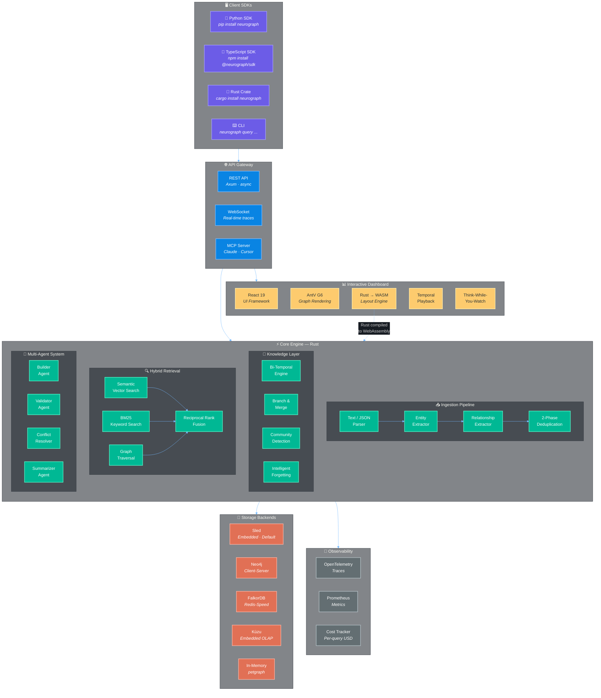

<p align="center">
  
</p>

<p align="center">
  <a href="https://crates.io/crates/neurograph"></a>
  <a href="https://pypi.org/project/neurograph/"></a>
  <a href="https://www.npmjs.com/package/@neurograph/sdk"></a>
  <a href="https://ghcr.io/neurographai/neurograph"></a>
  <a href="https://docs.rs/neurograph"></a>
</p>

<p align="center">
  <a href="https://github.com/neurographai/neurograph/actions/workflows/ci.yml"></a>
  <a href="https://codecov.io/gh/neurographai/neurograph"></a>
  <a href="https://scorecard.dev/viewer/?uri=github.com/neurographai/neurograph"></a>
  <a href="https://github.com/neurographai/neurograph/blob/main/LICENSE"></a>
</p>

<p align="center">
  <a href="https://github.com/neurographai/neurograph/stargazers"></a>
  <a href="https://github.com/neurographai/neurograph/network/members"></a>
  <a href="https://github.com/neurographai/neurograph/issues"></a>
  <a href="https://github.com/neurographai/neurograph/discussions"></a>
</p>

---

# 🧠 NeuroGraph

> **The Operating System for AI Knowledge**
> Ingest anything · Remember everything · Forget intelligently · Reason visually · Branch reality

<br/>

## Architecture



<br/>

<!-- Tech Stack Badges -->
<p align="center">
  <b>Core</b><br/>
  
  
  
  
</p>
<p align="center">
  <b>Storage</b><br/>
  
  
  
  
  
</p>
<p align="center">
  <b>Frontend</b><br/>
  
  
  
  
</p>
<p align="center">
  <b>AI / ML</b><br/>
  
  
  
  
</p>
<p align="center">
  <b>Infrastructure</b><br/>
  
  
  
  
</p>

---

## ⚡ Quick Start

```python
from neurograph import NeuroGraph

ng = NeuroGraph()

# Ingest knowledge
await ng.add("Alice joined Anthropic as a research scientist in March 2026")
await ng.add("Bob moved from Google to OpenAI in January 2026")

# Query with graph-powered RAG
result = await ng.query("Where does Alice work?")
print(result.answer)  # "Anthropic"

# Time travel
past = await ng.at("2025-12-01")
result = await past.query("Where does Bob work?")
print(result.answer)  # "Google"

# Branch reality
await ng.branch("what-if")
await ng.add("Alice leaves Anthropic for DeepMind")
diff = ng.diff_branches("main", "what-if")

# Open interactive dashboard
await ng.dashboard()  # → http://localhost:7777
```

---

## 📦 One-Command Install

```bash
# Rust developers
cargo install neurograph

# Python developers
pip install neurograph

# Node / TypeScript developers
npm install @neurograph/sdk

# Docker (full stack: API + Dashboard)
docker run -p 8000:8000 -p 3000:3000 ghcr.io/neurographai/neurograph

# Docker Compose
docker compose up
```

<details>
<summary><b>Developer Setup (from source)</b></summary>

Prerequisites: Rust (cargo 1.82+), Node.js (v18+)

```bash
# Clone
git clone https://github.com/neurographai/neurograph.git
cd neurograph

# Build Rust engine
cargo build --release

# Build Dashboard
cd dashboard && npm install && npm run dev

# Run server
cargo run --bin neurograph-server
```

</details>

---

## 🌟 What Makes NeuroGraph Different

| Feature | What It Does | Why It Matters |
|---------|-------------|----------------|
| **Think-While-You-Watch** | Ask a question → watch the AI traverse the graph in real-time, nodes glowing and edges animating as it reasons | You can SEE how the AI arrived at its answer — full transparency |
| **Temporal Playback** | Drag a timeline slider → the knowledge graph morphs to show what was true at any point in history | Track how knowledge evolves — like Git blame for facts |
| **Graph Branching** | `ng.branch("what-if")` → add hypothetical facts → `ng.diff()` to compare → `ng.merge()` when verified | Explore hypothetical scenarios without corrupting your real knowledge |
| **Intelligent Forgetting** | Facts automatically decay based on importance (PageRank + access frequency + recency) | Graphs don't grow forever — NeuroGraph manages its own memory |
| **Cost-Aware Router** | Set a budget → NeuroGraph auto-picks the cheapest strategy that meets quality | Never get a surprise LLM bill again |
| **Rust WASM Layouts** | Graph layout computed in Rust WebAssembly, not JavaScript | Render 100k-node graphs smoothly where JS would crash |
| **Zero API Key Mode** | Works completely offline: regex NER + local embeddings + embedded DB | Air-gapped environments, privacy-first, $0 cost |
| **Diff-Based Summaries** | When a community changes slightly, update the summary — don't regenerate it | ~70% token savings on community re-summarization |
| **Hybrid Search** | Semantic + BM25 + Graph Traversal fused with Reciprocal Rank Fusion | Better recall than any single search method alone |
| **Built-In Benchmarks** | `neurograph bench` runs accuracy, latency, and cost tests against standard datasets | Know exactly how good your graph is — with numbers |

---

## 📊 How NeuroGraph Compares

| Feature | NeuroGraph | GraphRAG (Microsoft) | Graphiti (Zep) | Mem0 |
|---------|-----------|----------------------|----------------|------|
| **Core Value**| **Bi-Temporal Knowledge & Extensible OS**| Batch document analysis | Temporal knowledge graph | Simple developer memory |
| **Query Speed** | **<200ms** (Rust) | ~5-10s | ~1s | ~1s |
| **Language** | Native Rust (Core), Py/TS wrappers | Python | Python | Python |
| **Temporal**| **Bi-temporal** | Static | Edge-based time | Recency only |
| **Dashboard** | **Interactive Browser** (G6 + WASM)| None / External Gephi | None / Neo4j Browser | Standard UI |
| **Self-Hosted** | **$0 Offline Mode** (Regex + FastEmbed)| High LLM cost for map stage | Free | Free |
| **Communities** | **Rust Louvain/Leiden** | Python NetworkX | No | No |
| **Decay**| **Importance-based Forgetting** | No | No | Optional API |

---

## ⚡ Performance

Built on Rust. No GIL. No garbage collector. No excuses.

| Metric | NeuroGraph |
|--------|-----------|
| **Query Latency (P50)** | <150ms |
| **Query Latency (P99)** | <500ms |
| **Indexing Speed** | ~500 docs/min |
| **Graph Layout (100k nodes)** | <500ms (Rust WASM) |
| **Community Detection (50k edges)** | <1s (Rust native) |
| **Memory Usage** | ~50MB base |
| **Cold Start** | <2s |
| **Cost per 1k Queries** | ~$0.50 (with GPT-4o-mini) |
| **Cost per 1k Queries** | $0.00 (fully local / Ollama) |
| **Max Tested Graph Size** | 1M+ nodes |

<details>
<summary>Benchmark methodology</summary>

- Hardware: Single M2 MacBook Pro (16GB RAM)
- Dataset: 1,000 news articles (~500k tokens)
- LLM: GPT-4o-mini for extraction, FastEmbed local for search
- Database: Embedded sled (zero-config)
- Full methodology: [benchmarks/README.md](./benchmarks/README.md)

</details>

---

## 🧩 API at a Glance

| Operation | Python | Rust |
|-----------|--------|------|
| **Create** | `ng = NeuroGraph()` | `let ng = NeuroGraph::builder().build().await?;` |
| **Ingest text** | `await ng.add("Alice joined Anthropic")` | `ng.add_text("Alice joined Anthropic").await?;` |
| **Ingest JSON** | `await ng.add({"name": "Alice"})` | `ng.add_json(json!({"name": "Alice"})).await?;` |
| **Query** | `result = await ng.query("Where does Alice work?")` | `let result = ng.query("Where does Alice work?").await?;` |
| **Time travel** | `past = await ng.at("2025-01-01")` | `let past = ng.at("2025-01-01").await?;` |
| **Entity history** | `history = await ng.history("alice")` | `let history = ng.history("alice").await?;` |
| **What changed** | `diff = await ng.what_changed("2025-01", "2026-01")` | `let diff = ng.what_changed("2025-01", "2026-01").await?;` |
| **Branch** | `await ng.branch("hypothesis")` | `ng.branch("hypothesis").await?;` |
| **Diff branches** | `diff = ng.diff_branches("main", "hypothesis")` | `let diff = ng.diff_branches("main", "hypothesis")?;` |
| **Communities** | `ng.detect_communities()` | `ng.detect_communities();` |
| **Dashboard** | `await ng.dashboard()` | `ng.serve(7777).await?;` |
| **Search** | `entities = await ng.search("Alice")` | `let entities = ng.search("Alice").await?;` |

---

## 🔌 Integrations

<details>
<summary><b>LLM Providers</b></summary>

| Provider | Models | Local/Cloud |
|----------|--------|-------------|
| OpenAI | GPT-4o, GPT-4o-mini, GPT-4-turbo | Cloud |
| Anthropic | Claude 4, Claude 3.5 Sonnet | Cloud |
| Google Gemini | Gemini 2.0 Flash, Gemini Pro | Cloud |
| Ollama | Llama 3, DeepSeek, Mistral, Phi | Local |
| Any OpenAI-compatible | LM Studio, vLLM, Together AI | Local/Cloud |
| **None (offline mode)** | **Regex NER + rule-based extraction** | **Local** |

</details>

<details>
<summary><b>Graph Databases</b></summary>

| Backend | Type | Setup Required |
|---------|------|----------------|
| **Embedded (sled)** | **Embedded** | **None — default** |
| In-Memory (petgraph) | In-process | None |
| Kuzu | Embedded | None |
| Neo4j | Client-server | Docker or Neo4j Desktop |
| FalkorDB | Client-server | Docker |

</details>

<details>
<summary><b>Embedding Providers</b></summary>

| Provider | Models | Local/Cloud |
|----------|--------|-------------|
| **FastEmbed (default)** | **bge-small-en-v1.5** | **Local** |
| OpenAI | text-embedding-3-small/large | Cloud |
| Sentence Transformers | Any HuggingFace model | Local |

</details>

<details>
<summary><b>Agent Frameworks</b></summary>

| Framework | Integration Type |
|-----------|-----------------|
| LangGraph | Drop-in memory adapter |
| CrewAI | Shared memory across agents |
| AutoGen | Memory adapter |
| OpenAI Agents SDK | Compatible memory interface |
| MCP (Claude/Cursor) | Full MCP server |

</details>

<details>
<summary><b>Observability</b></summary>

| Tool | What's Tracked |
|------|---------------|
| OpenTelemetry | Distributed traces for every operation |
| Prometheus | Metrics: latency, throughput, cache hits |
| Built-in Cost Tracker | Per-query: model, tokens, cost USD, latency ms |

</details>

---

## 📋 Features

| Capability | Status |
|---|---|
| **Temporal Knowledge Graph** — Bi-temporal facts with `valid_from` / `valid_until` | ✅ Completed |
| **Community Detection** — Hierarchical Louvain/Leiden in native Rust | ✅ Completed |
| **Interactive Dashboard** — Browser-based graph explorer powered by G6 + Rust WASM | ✅ Completed |
| **Sub-200ms Queries** — Rust-native hybrid retrieval (semantic + keyword + graph walk) | ✅ Completed |
| **Graph Version Control** — Branch, diff, and merge knowledge graphs like Git | ✅ Completed |
| **Think-While-You-Watch** — Watch AI reasoning animate on the graph in real-time | ✅ Completed |
| **Temporal Playback** — Scrub a timeline slider to see knowledge evolve | ✅ Completed |
| **Intelligent Forgetting** — Importance-based decay, compression, and archival | ✅ Completed |
| **Cost-Aware Routing** — Auto-selects cheapest query strategy within your budget | ✅ Completed |
| **Multi-Agent Graph Building** — 5 collaborative agents with visual debugging | ✅ Completed |
| **MCP Server** — Give Claude, Cursor, and other AI tools graph-based memory | ✅ Completed |
| **Zero Config** — `pip install neurograph` → 3 lines → done. No Docker. No API key. | ✅ Completed |

<details>
<summary><b>Click to expand all 87 features</b></summary>

### Reasoning and Knowledge

| Feature | Details |
|---------|---------|
| Entity extraction (LLM) | Structured JSON output via OpenAI / Anthropic / Gemini / Ollama |
| Entity extraction (offline) | Regex-based NER fallback — works without any API key |
| Relationship extraction | Automatic from text + manual from structured JSON |
| Multi-hop reasoning | Graph walk + LLM reasoning across connected entities |
| Community detection (Louvain) | Native Rust implementation on petgraph — O(n log n) |
| Community detection (Leiden) | Hierarchical with resolution parameter and level control |
| Incremental community updates | k-hop delta recomputation — only affected neighborhoods |
| Community summarization | LLM map-reduce with hierarchical rollup |
| Diff-based re-summarization | Update summaries incrementally at ~30% token cost |
| Hierarchical community levels | Multi-resolution from macro themes to micro topics |
| Cost-aware query routing | Classifies query → estimates cost per strategy → selects optimal |
| Local queries | Direct entity/subgraph retrieval (fastest, cheapest) |
| Global queries | Community summary map-reduce (comprehensive) |
| DRIFT search | Dynamic local-global fusion |
| Temporal queries | Time-filtered retrieval respecting fact validity windows |
| Multi-hop queries | Graph traversal + LLM chain reasoning |

### Retrieval and Search

| Feature | Details |
|---------|---------|
| Semantic vector search | Cosine similarity on embeddings (OpenAI / FastEmbed / any provider) |
| BM25 keyword search | Full-text search via tantivy |
| Graph traversal search | Scored BFS/DFS from seed entities |
| Hybrid retrieval | Reciprocal Rank Fusion (RRF) combining all three methods |
| Cross-encoder reranking | LLM-based passage relevance scoring |
| Pre-built search recipes | `find_entity`, `find_connections`, `find_community`, `temporal_search` |
| Context assembly | Token-budget-aware graph → LLM prompt with citations + confidence |

### Temporal and Data Management

| Feature | Details |
|---------|---------|
| Bi-temporal model | Every fact has `valid_from` and `valid_until` timestamps |
| Automatic fact invalidation | New contradicting facts invalidate old ones (not delete) |
| Point-in-time queries | `ng.at("2026-03-15")` returns graph state at that moment |
| Entity history | `ng.history("alice")` returns full chronological fact chain |
| Temporal diff | `ng.what_changed("2026-01", "2026-06")` shows additions/removals |
| Graph branching | `ng.branch("hypothesis")` creates copy-on-write branch |
| Graph diff | `ng.diff_branches("main", "hypothesis")` shows differences |
| Graph merge | 4 strategies: SourceWins, TargetWins, VerifiedOnly, TemporalMerge |
| Named snapshots | Immutable point-in-time snapshots with labels |
| Intelligent forgetting | Importance scoring via PageRank + access frequency + recency |
| Configurable decay | Exponential, linear, step-function, or no decay |
| Compression | Merge low-importance similar entities into summaries |
| Archival | Move old facts to cold storage after configurable TTL |
| Episode/provenance tracking | Every fact traces back to source data (text, JSON, file) |
| Prescribed ontology | Define entity/edge types upfront via typed schemas |
| Learned ontology | Automatically discover entity types from data |
| 2-phase deduplication | Phase 1: embedding similarity + hash. Phase 2: LLM fallback |
| Contradiction resolution | Temporal invalidation with full history preserved |

### Visualization and Dashboard

| Feature | Details |
|---------|---------|
| Built-in interactive dashboard | `await ng.dashboard()` opens browser at localhost:7777 |
| WebGL/Canvas rendering | G6 engine with multi-layer canvas (background, main, label) |
| Force-directed layout | Rust WASM — 10-50x faster than JavaScript equivalent |
| Hierarchical layout | Dagre-style for tree/DAG structures |
| Radial layout | Ego-centric view centered on selected entity |
| Circular layout | For small, dense subgraphs |
| Temporal layout | X-axis = time, Y-axis = entity groups |
| Think-While-You-Watch | Live animation of AI reasoning path on the graph |
| Temporal playback slider | Scrub through time — nodes appear/disappear as facts change |
| Semantic zoom | Zoom in = entity details. Zoom out = community summaries |
| Community clusters | G6 Combos with color-coded boundaries |
| Natural language search | Type a question → results highlight paths on graph |
| Entity detail panel | Click any node → see summary, relationships, full history |
| Relationship detail panel | Click any edge → see fact, validity window, provenance |
| Community detail panel | Click any cluster → see summary, members, sub-communities |
| Graph statistics panel | Node count, edge count, community count, cost tracker |
| Dark mode | Default premium dark theme with glassmorphism |
| Light mode | Clean light theme for presentations |
| Minimap | Bird's-eye view navigation |
| Tooltips | Hover to preview entity/relationship info |
| Context menu | Right-click for actions (expand, hide, explore) |
| Cost meter | Real-time query cost gauge |
| React embeddable components | `@neurograph/react` for embedding in any app |
| Playback controls | Play, pause, speed (1x/2x/5x/10x) for temporal animation |

### Agent and Integration Support

| Feature | Details |
|---------|---------|
| Agent memory interface | `ng.as_memory()` returns framework-compatible memory |
| Builder agent | Extracts entities and relationships from data |
| Validator agent | Verifies extracted facts against sources |
| Conflict resolver agent | Resolves contradictions between facts |
| Schema aligner agent | Ensures new entities match prescribed ontology |
| Summarizer agent | Generates and updates community summaries |
| Multi-agent visual debugging | Watch agents negotiate on the graph in real-time |
| LangGraph integration | Drop-in memory adapter for LangGraph agents |
| CrewAI integration | Shared knowledge graph across crew members |
| AutoGen integration | Memory adapter for AutoGen agents |
| OpenAI Agents SDK | Compatible memory interface |
| MCP server | Full Model Context Protocol server for Claude/Cursor |

### Infrastructure and Developer Experience

| Feature | Details |
|---------|---------|
| Zero-config embedded mode | `pip install neurograph` → 3 lines → works |
| Embedded database (sled) | Persistent storage, no Docker required |
| In-memory mode | Pure petgraph backend for testing and prototyping |
| Neo4j driver | Connect to existing Neo4j instances |
| FalkorDB driver | Connect to FalkorDB for redis-speed graph queries |
| Kuzu driver | Embedded analytical graph database |
| OpenAI LLM | GPT-4o, GPT-4o-mini, GPT-4-turbo |
| Anthropic LLM | Claude 4, Claude 3.5 Sonnet |
| Google Gemini | Gemini 2.0 Flash, Gemini Pro |
| Ollama (local) | DeepSeek, Llama, Mistral — fully offline |
| Generic OpenAI-compatible | Any API following OpenAI spec (LM Studio, vLLM, etc.) |
| No API key mode | Regex NER + local FastEmbed — zero cost, zero internet |
| REST API | Axum-based, async, production-ready |
| WebSocket | Real-time graph updates + reasoning traces |
| Python SDK | Native PyO3 bindings — Rust speed with Python API |
| TypeScript SDK | `@neurograph/client` for Node.js + browser |
| Rust SDK | Native, zero-overhead Rust API |
| CLI | `neurograph serve`, `neurograph ingest`, `neurograph query` |
| Docker | Multi-stage build, slim runtime image |
| Docker Compose | Full stack (server + dashboard) or embedded-only |
| OpenTelemetry | Distributed tracing + Prometheus metrics |
| Per-operation cost tracking | Every LLM call logs: model, tokens, cost, latency |
| Cost dashboard | Visual cost breakdown in the browser |
| Built-in benchmark suite | Compare your graph quality against standard datasets |
| Plugin system | Trait-based hooks: `on_ingest`, `on_query`, `on_extract` |
| Biomedical plugin (example) | Gene/protein/disease extraction |
| Codebase plugin (example) | Source code analysis and dependency graphing |

</details>

---

## 📚 Documentation

- [Architecture Details](docs/architecture.md)
- [Temporal Engine Guide](docs/temporal.md)
- [Community Detection](docs/community.md)
- [Developing Guide](DEVELOPING.md)
- [Contributing](CONTRIBUTING.md)
- [Security Policy](SECURITY.md)
- [Changelog](CHANGELOG.md)

## 🗺️ Roadmap

- Distributed graph sharding across multiple nodes
- Enriched Python SDK hooks and async iterators
- Helm chart for Kubernetes one-click deploy
- Browser extension for knowledge capture
- See the [issue tracker](https://github.com/neurographai/neurograph/issues) for feature voting

## 🤝 Contributing

We welcome contributions! See [CONTRIBUTING.md](CONTRIBUTING.md) for guidelines.

```bash
# Quick dev setup
git clone https://github.com/neurographai/neurograph.git
cd neurograph
cargo test --workspace
```

## 📄 License

[Apache-2.0](LICENSE) — use it freely in commercial and open-source projects.

## 📖 Citation

If you use NeuroGraph in your research, please cite it:

```bibtex
@software{neurograph,
  title = {NeuroGraph: A Rust-Powered Temporal Knowledge Graph Engine for AI Agents},
  author = {Ashutosh Kumar Singh},
  year = {2026},
  url = {https://github.com/neurographai/neurograph},
  license = {Apache-2.0}
}
```

---

<p align="center">
  <b>Built with 🧠 by <a href="https://github.com/Ashutosh0x">Ashutosh Kumar Singh</a></b>
  <br/>
  <sub>If NeuroGraph helps your project, consider ⭐ starring the repo!</sub>
</p>
