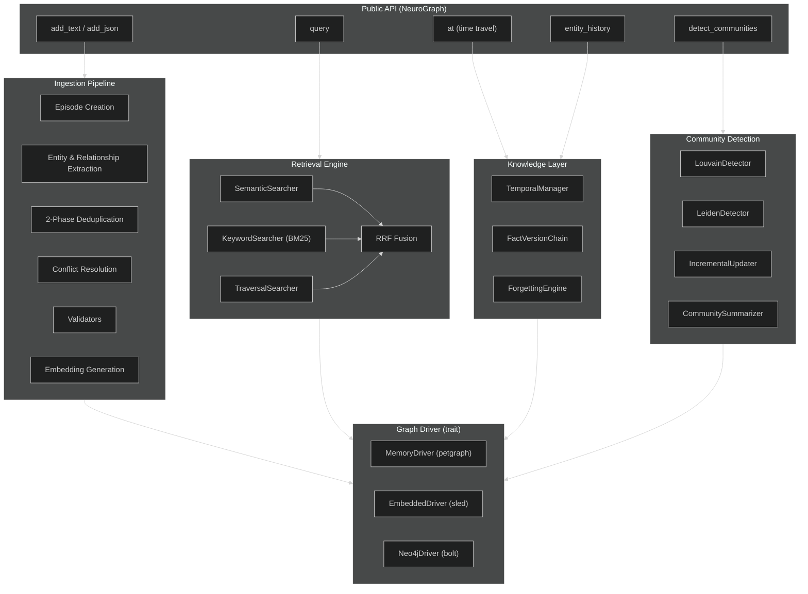
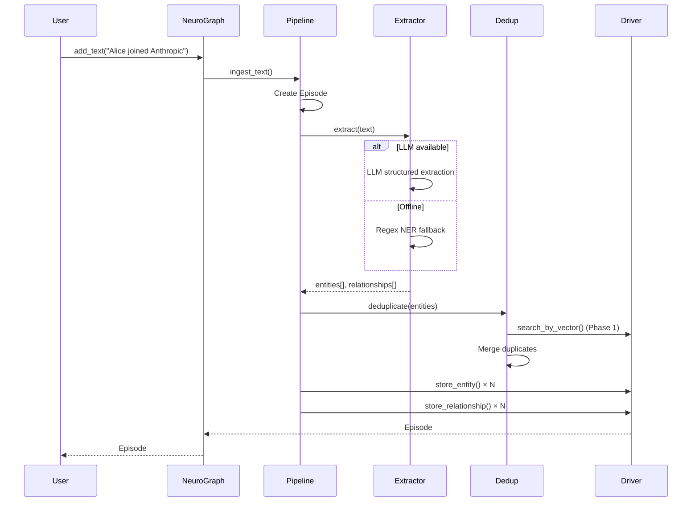
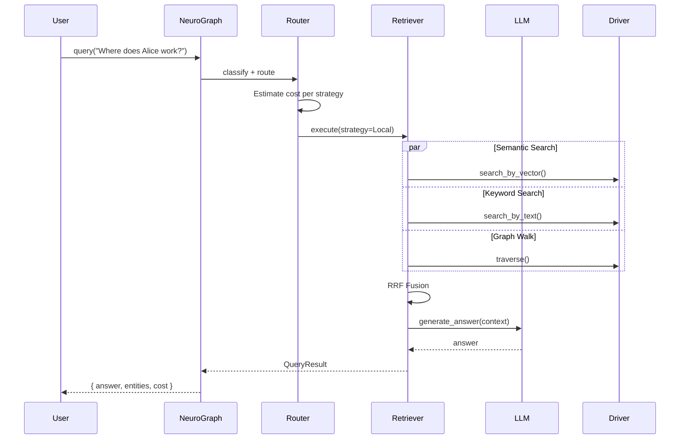

# NeuroGraph Architecture

> A deep-dive into the system design of NeuroGraph — a Rust-powered temporal knowledge graph engine.

---

## Table of Contents

- [High-Level Overview](#high-level-overview)
- [System Architecture Diagram](#system-architecture-diagram)
- [Core Modules](#core-modules)
  - [NeuroGraph (Public API)](#neurograph-public-api)
  - [Ingestion Pipeline](#ingestion-pipeline)
  - [Knowledge Layer](#knowledge-layer)
  - [Retrieval Engine](#retrieval-engine)
  - [Engine & Query Router](#engine--query-router)
- [Storage Architecture](#storage-architecture)
- [Embedding Architecture](#embedding-architecture)
- [Temporal Architecture](#temporal-architecture)
- [Community Detection Architecture](#community-detection-architecture)
- [Dashboard Architecture](#dashboard-architecture)
- [Data Flow](#data-flow)
- [Concurrency Model](#concurrency-model)
- [Error Handling Strategy](#error-handling-strategy)
- [Deployment Topology](#deployment-topology)

---

## High-Level Overview

NeuroGraph is structured as a **Rust workspace** with a layered architecture:

```
┌──────────────────────────────────────────────────────────┐
│                 NeuroGraph (Public API)                   │
│      add_text · add_json · query · at · history           │
├──────────────────────────────────────────────────────────┤
│              Engine (Orchestration Layer)                  │
│    QueryRouter · ContextAssembler · CostTracker           │
├────────────────┬─────────────────┬───────────────────────┤
│ Ingestion      │   Knowledge     │   Retrieval            │
│ Pipeline       │   Layer         │   Engine               │
│ ────────────   │ ─────────────   │ ──────────────         │
│ extractors     │ temporal mgr    │ semantic search        │
│ deduplication  │ fact versions   │ keyword (BM25)         │
│ conflict res.  │ forgetting      │ graph traversal        │
│ validators     │ branching       │ RRF fusion             │
├────────────────┼─────────────────┼───────────────────────┤
│ LLM Client     │   Embedder      │   Community            │
│ openai/regex   │ openai/hash     │ louvain/leiden         │
├────────────────┴─────────────────┴───────────────────────┤
│                   Graph Driver (trait)                     │
│      MemoryDriver · EmbeddedDriver (sled) · Neo4j         │
└──────────────────────────────────────────────────────────┘
```

### Design Principles

1. **Zero-configuration first** — `NeuroGraph::builder().build()` works with no API keys, no external services, and no config files. It uses in-memory storage, hash-based embeddings, and regex entity extraction.

2. **Trait-based abstraction** — All I/O boundaries (`GraphDriver`, `Embedder`, `LlmClient`) are defined as async traits, making the engine storage-agnostic and testable.

3. **Cost-awareness** — Every LLM call is tracked (`CostTracker`), and query routing considers the dollar cost of each strategy before execution.

4. **Temporal-first** — Time is not an afterthought. Every fact has a `valid_from` / `valid_until` window, and every query can time-travel.

---

## System Architecture Diagram



---

## Core Modules

### NeuroGraph (Public API)

**Location:** `crates/neurograph-core/src/lib.rs`

The `NeuroGraph` struct is the primary entry point. It holds:

| Field | Type | Purpose |
|-------|------|---------|
| `config` | `NeuroGraphConfig` | All configuration (storage, LLM, budget, etc.) |
| `driver` | `Arc<dyn GraphDriver>` | Storage backend |
| `embedder` | `Arc<dyn Embedder>` | Vector embedding provider |
| `llm` | `Option<Arc<dyn LlmClient>>` | Optional LLM for extraction |
| `schema` | `Arc<RwLock<GraphSchema>>` | Entity/relationship type registry |
| `router` | `QueryRouter` | Query classification and routing |
| `limiter` | `ConcurrencyLimiter` | Bounds on concurrent LLM calls |
| `cost_tracker` | `CostTracker` | Budget enforcement |

The builder pattern (`NeuroGraphBuilder`) handles initialization:

```rust
let ng = NeuroGraph::builder()
    .name("my-graph")
    .embedded("./data/graph.db")  // persistent storage
    .budget(1.0)                   // $1 max LLM spend
    .build()
    .await?;
```

### Ingestion Pipeline

**Location:** `crates/neurograph-core/src/ingestion/`

```
ingestion/
├── pipeline.rs        # Main orchestrator (IngestionPipeline)
├── extractors/        # Entity & relationship extractors (LLM + regex)
├── deduplication.rs   # 2-phase entity dedup (embedding + LLM)
├── conflict.rs        # Temporal conflict resolution
├── validators.rs      # Post-extraction validators
└── mod.rs
```

The ingestion pipeline processes raw text through a multi-stage pipeline:

```
Raw Text → Episode → Extraction → Deduplication → Conflict Resolution → Storage
```

**Stage 1: Episode Creation**
Every piece of ingested data is wrapped in an `Episode` — a provenance record tracking the source, timestamp, and processing metadata.

**Stage 2: Extraction**
Two paths, selected automatically:
- **LLM extraction** (when `OPENAI_API_KEY` is set): Structured JSON output via the LLM, producing typed entities and relationships with confidence scores.
- **Regex fallback** (offline mode): Pattern-based NER that detects persons, organizations, locations, dates, and simple relationships. Zero cost, zero latency.

**Stage 3: 2-Phase Deduplication**
- **Phase 1 — Fast pass:** Embedding cosine similarity + hash matching. Entities with >0.95 similarity are merged automatically.
- **Phase 2 — LLM fallback:** Ambiguous cases (0.8–0.95 similarity) are sent to the LLM for semantic comparison. This catches "Alice Smith" vs "A. Smith" cases.

**Stage 4: Conflict Resolution**
When a new fact contradicts an existing one (e.g., "Alice works at Google" vs. "Alice works at Anthropic"), the temporal conflict resolver:
1. Marks the old relationship's `valid_until` to the new fact's `valid_from`
2. Creates the new relationship with the current timestamp
3. Links old → new via `superseded_by`

**Stage 5: Validation**
Post-processing validators check entity type consistency, relationship cardinality, and embedding dimensions.

### Knowledge Layer

**Location:** `crates/neurograph-core/src/temporal/` and `crates/neurograph-core/src/community/`

The knowledge layer manages the evolution of facts over time. See [Temporal Engine](temporal.md) and [Community Detection](community.md) for deep-dives.

### Retrieval Engine

**Location:** `crates/neurograph-core/src/retrieval/`

```
retrieval/
├── hybrid.rs       # HybridRetriever (RRF fusion)
├── semantic.rs     # SemanticSearcher (cosine similarity)
├── keyword.rs      # KeywordSearcher (BM25-like scoring)
├── traversal.rs    # TraversalSearcher (BFS/DFS scoring)
├── reranker.rs     # Result reranking with LLM
├── recipes.rs      # Pre-built search strategies
└── mod.rs
```

**Reciprocal Rank Fusion (RRF):** The core innovation in the retrieval pipeline. Rather than trying to normalize incompatible score scales from different search methods, RRF works purely on rank:

```
score(d) = Σ weight_i / (k + rank_i(d))
```

Where `k = 60` (standard constant). This produces a single ranked list from three sources:

| Method | Default Weight | What It Does |
|--------|---------------|--------------|
| Semantic | 0.5 | Cosine similarity on embeddings — finds conceptually similar entities |
| Keyword (BM25) | 0.3 | Token-overlap scoring — catches exact matches the embedding might miss |
| Graph Traversal | 0.2 | BFS from seed entities — follows the graph structure |

### Engine & Query Router

**Location:** `crates/neurograph-core/src/engine/`

```
engine/
├── router.rs       # QueryRouter — classifies and routes queries
├── context.rs      # ContextAssembler — builds LLM prompts
├── budget.rs       # Budget estimation per strategy
├── strategies/     # Execution strategies (local, global, temporal)
└── mod.rs
```

The `QueryRouter` classifies incoming queries and selects the optimal execution strategy:

| Strategy | Query Pattern | Example | Cost |
|----------|--------------|---------|------|
| **Local** | Entity-specific questions | "Where does Alice work?" | Low |
| **Global** | Broad, thematic questions | "What themes dominate AI research?" | High |
| **Temporal** | Time-specific questions | "Who worked at Google in 2023?" | Medium |

The router also estimates the dollar cost of each strategy and selects the cheapest one that meets the quality threshold (budget-aware routing).

---

## Storage Architecture

The `GraphDriver` trait abstracts all storage operations:

```rust
#[async_trait]
pub trait GraphDriver: Send + Sync {
    fn name(&self) -> &str;
    async fn store_entity(&self, entity: &Entity) -> Result<()>;
    async fn get_entity(&self, id: &EntityId) -> Result<Entity>;
    async fn search_entities_by_vector(&self, ...) -> Result<Vec<ScoredEntity>>;
    async fn search_entities_by_text(&self, ...) -> Result<Vec<ScoredEntity>>;
    async fn store_relationship(&self, rel: &Relationship) -> Result<()>;
    async fn get_entity_relationships(&self, id: &EntityId) -> Result<Vec<Relationship>>;
    async fn snapshot_at(&self, timestamp: &DateTime<Utc>, ...) -> Result<Subgraph>;
    async fn traverse(&self, start: &EntityId, depth: usize, ...) -> Result<Subgraph>;
    async fn store_community(&self, community: &Community) -> Result<()>;
    async fn stats(&self) -> Result<HashMap<String, usize>>;
    async fn clear(&self) -> Result<()>;
    // ... more methods
}
```

### Backend Comparison

| Backend | Type | Use Case | Data Location |
|---------|------|----------|---------------|
| **MemoryDriver** | In-process | Unit tests, prototyping, ephemeral sessions | RAM only |
| **EmbeddedDriver (sled)** | Embedded | Production single-node, persistent, zero-config | Local filesystem |
| **Neo4jDriver** | Client-server | Large-scale production, existing Neo4j infra | Remote server |
| **FalkorDB** | Client-server | Redis-speed graph queries | Remote server |
| **Kuzu** | Embedded OLAP | Analytical queries over graph | Local filesystem |

### Data Model

Every entity and relationship in NeuroGraph follows this structure:

```
Entity
├── id: EntityId (UUID v4)
├── name: String
├── entity_type: String ("Person", "Organization", ...)
├── summary: String
├── name_embedding: Option<Vec<f32>>
├── group_id: String
├── created_at: DateTime<Utc>
├── updated_at: DateTime<Utc>
├── importance_score: f64   (for decay/forgetting)
├── access_count: u64       (for access-frequency scoring)
└── attributes: HashMap<String, String>

Relationship
├── id: RelationshipId (UUID v4)
├── source_entity_id: EntityId
├── target_entity_id: EntityId
├── relationship_type: String ("WORKS_AT", "FOUNDED", ...)
├── fact: String (human-readable fact text)
├── fact_embedding: Option<Vec<f32>>
├── weight: f64
├── valid_from: DateTime<Utc>
├── valid_until: Option<DateTime<Utc>>
├── created_at: DateTime<Utc>
├── expired_at: Option<DateTime<Utc>>
├── episode_id: EpisodeId
└── group_id: String

Community
├── id: CommunityId (UUID v4)
├── name: String
├── level: u32 (hierarchy depth)
├── summary: Option<String>
├── member_ids: Vec<EntityId>
└── created_at: DateTime<Utc>
```

---

## Embedding Architecture

Embeddings power both entity deduplication and semantic search. The `Embedder` trait:

```rust
#[async_trait]
pub trait Embedder: Send + Sync {
    async fn embed_one(&self, text: &str) -> Result<Vec<f32>>;
    async fn embed_batch(&self, texts: &[String]) -> Result<Vec<Vec<f32>>>;
    fn model_name(&self) -> &str;
    fn dimensions(&self) -> usize;
}
```

**Implementations:**

| Embedder | Dimensions | Latency | Cost | Offline |
|----------|-----------|---------|------|---------|
| `HashEmbedder` (default) | 128 | <1ms | $0 | ✅ |
| `OpenAiEmbedder` | 1536 | ~200ms | ~$0.0001/call | ❌ |

The `HashEmbedder` uses a deterministic hash-based approach: texts are tokenized, hashed, and projected into a fixed-dimension space. This provides reasonable similarity (especially for exact/near-exact match dedup) at zero cost and zero latency. For production quality semantic search, swap to OpenAI embeddings.

---

## Temporal Architecture

See [Temporal Engine documentation](temporal.md) for the full deep-dive.

**Key insight:** NeuroGraph implements a **bi-temporal** model where every fact has two time dimensions:

1. **Valid time** — When the fact was true in reality (`valid_from`, `valid_until`)
2. **Transaction time** — When we recorded/invalidated it (`created_at`, `expired_at`)

This enables two types of temporal queries:
- "What was true on date X?" → valid time query
- "What did we know on date X?" → transaction time query

---

## Community Detection Architecture

See [Community Detection documentation](community.md) for the full deep-dive.

NeuroGraph implements **Louvain** and **Leiden** algorithms in pure Rust, operating directly on the graph stored in the driver. Communities are computed incrementally — when new entities are added, only the affected k-hop neighborhood is recomputed.

---

## Dashboard Architecture

**Location:** `dashboard/`

The dashboard is a React 19 + TypeScript + Vite application that renders the knowledge graph using **AntV G6**, a high-performance graph visualization library. State management is handled by **Zustand** for a lightweight, predictable store.

```
dashboard/
├── src/
│   ├── App.tsx              # Main 3-column layout shell
│   ├── App.css              # Complete design system (dark + light themes)
│   ├── index.css            # Base resets, Inter + JetBrains Mono fonts
│   ├── components/
│   │   ├── GraphCanvas.tsx       # G6 graph renderer
│   │   ├── QueryPanel.tsx        # Natural-language query input + results
│   │   ├── BranchDiffPanel.tsx   # Branch selector + diff viewer
│   │   ├── NodeDetailPanel.tsx   # Right sidebar node inspector
│   │   ├── TimelineSlider.tsx    # Temporal playback with density heatmap
│   │   ├── GraphViewSwitcher.tsx # Edge-type filter tabs
│   │   └── ThemeToggle.tsx       # Animated dark/light mode toggle
│   ├── store/
│   │   └── graphStore.ts    # Zustand store (nodes, edges, timeline, branches, theme)
│   ├── assets/
│   │   └── logo.png         # NeuroGraph hexagonal logo
│   └── types/
│       └── graph.ts         # G6 type definitions
├── Dockerfile               # Nginx-based production container
├── nginx.conf               # SPA routing + API proxy config
├── vite.config.ts
├── tsconfig.json
└── package.json
```

**Key architectural decisions:**

1. **AntV G6 for rendering** — WebGL/Canvas rendering with 10k+ nodes, force-directed layouts, and built-in interaction handlers (zoom, pan, select, drag).

2. **Zustand for state** — Lightweight store managing graph data, timeline state, branch selection, query results, reasoning animation, and theme preference. Persists theme to `localStorage`.

3. **3-Column layout** — Left sidebar (query + branches + legend), center (graph canvas + timeline), right sidebar (node detail when selected).

4. **Dark/Light mode** — CSS custom properties (`--bg-primary`, `--text-primary`, etc.) scoped under `[data-theme='light']` selector. Toggle persists via `localStorage('ng-theme')` and syncs to `document.documentElement.dataset.theme`.

5. **Temporal playback** — The timeline slider with density heatmap controls the `snapshot_at(timestamp)` API, dynamically filtering which nodes and edges are visible.

6. **Community visualization** — Communities are rendered as G6 Combos (grouped clusters) with distinct colors per community.

7. **Production Dockerfile** — Multi-stage build: Node.js builder → Nginx runtime with SPA routing and API reverse proxy.

---

## Data Flow

### Ingestion Flow



### Query Flow



---

## Concurrency Model

NeuroGraph uses **Tokio** as its async runtime. Key concurrency mechanisms:

| Mechanism | Location | Purpose |
|-----------|----------|---------|
| `ConcurrencyLimiter` | `utils/concurrency.rs` | Semaphore-bounded concurrent LLM calls (default: 4) |
| `DashMap` | `MemoryDriver` | Lock-free concurrent hash maps for entity storage |
| `parking_lot::RwLock` | Schema registry | Reader-writer lock for schema mutations |
| `Arc<dyn GraphDriver>` | Everywhere | Shared ownership of the driver across async tasks |

All graph driver operations are `async` and `Send + Sync`, allowing them to be used across Tokio task boundaries.

---

## Error Handling Strategy

NeuroGraph uses `thiserror` for structured error types:

```rust
#[derive(Debug, thiserror::Error)]
pub enum NeuroGraphError {
    #[error("Driver error: {0}")]
    Driver(#[from] DriverError),

    #[error("LLM error: {0}")]
    Llm(#[from] LlmError),

    #[error("Budget exceeded: ${spent:.4} of ${limit:.4} used")]
    BudgetExceeded { spent: f64, limit: f64 },

    // ... more variants
}
```

Each subsystem has its own error type (`TemporalError`, `CommunityError`, `ForgettingError`, etc.) that converts into `NeuroGraphError` at the public API boundary. This provides:

- **Typed errors** at the subsystem level (pattern match on specific failures)
- **Unified errors** at the API level (single `Result<T>` for callers)

---

## Deployment Topology

### Single-Node (Default)

```
┌─────────────────────────────────┐
│           Host Machine          │
│  ┌────────────┐  ┌───────────┐ │
│  │ NeuroGraph  │  │ Dashboard │ │
│  │ (Rust API)  │  │ (React)   │ │
│  │ :8000       │  │ :3000     │ │
│  └─────┬──────┘  └─────┬─────┘ │
│        │   sled (embed) │       │
│        └──┬─────────────┘       │
│           │                     │
│  ┌────────▼────────┐            │
│  │ ./data/graph.db │            │
│  └─────────────────┘            │
└─────────────────────────────────┘
```

### Docker Compose (Full Stack)

```
┌──────────────────────────────────────────────────┐
│                Docker Compose                     │
│                                                   │
│  ┌──────────┐  ┌──────────┐  ┌──────────────────┐│
│  │neurograph │  │dashboard │  │ neo4j             ││
│  │:8000      │  │:3000     │  │ :7474 (browser)   ││
│  │           │  │          │  │ :7687 (bolt)      ││
│  └─────┬─────┘  └──────────┘  └──────────────────┘│
│        │                                          │
│  ┌─────▼─────────────────────────────────────────┐│
│  │ Volumes: graph-data, neo4j-data               ││
│  └───────────────────────────────────────────────┘│
└──────────────────────────────────────────────────┘
```

### Observability Stack

```
NeuroGraph ─── OpenTelemetry ──► Prometheus ──► Grafana
     │
     └── Built-in Cost Tracker ──► /api/v1/stats
```

Per-query metrics tracked:
- Model name and provider
- Token count (input + output)
- Cost in USD
- Latency in milliseconds
- Cache hit/miss ratio

---

## What is Graph RAG?

**Graph RAG** (Retrieval-Augmented Generation with Knowledge Graphs) is an architecture that enhances LLM responses by grounding them in structured knowledge graphs rather than flat document chunks.

### The Problem with Vanilla RAG

Traditional RAG splits documents into chunks, embeds them, and retrieves the most similar chunks for each query. This fails when:

1. **Multi-hop reasoning is needed** — "Who is the CEO of the company Alice works at?" requires connecting Alice → Company → CEO, which may span multiple chunks.
2. **Global questions are asked** — "What are the main themes in this dataset?" can't be answered by any single chunk.
3. **Temporal reasoning** — "Where did Bob work before joining OpenAI?" requires understanding the sequence of facts.
4. **Contradictions exist** — When sources disagree, flat RAG has no mechanism to resolve conflicts.

### How Graph RAG Works

```
Documents → Entity/Relationship Extraction → Knowledge Graph → Community Detection → Hierarchical Summaries
                                                    │
                                                    ▼
                                            Query → Graph Search + Vector Search → RRF Fusion → LLM Answer
```

1. **Build the graph:** Extract entities and relationships from documents using an LLM or NER system. Store them as nodes and edges in a graph.

2. **Detect communities:** Run community detection (Louvain/Leiden) to find clusters of related entities. Summarize each community.

3. **Multi-modal retrieval:** For each query, search the graph using multiple methods (semantic similarity, keyword matching, graph traversal) and fuse results using Reciprocal Rank Fusion.

4. **Graph-grounded generation:** Feed the retrieved entities, relationships, and community summaries to an LLM to generate an answer with citations.

### NeuroGraph's Graph RAG Implementation

NeuroGraph extends the Graph RAG paradigm with:

- **Bi-temporal facts**: Every relationship has a validity window, enabling time-travel queries
- **Zero-config offline mode**: Works without any API key using regex NER and hash embeddings
- **Cost-aware routing**: Automatically selects the cheapest query strategy that meets quality requirements
- **Incremental updates**: New data is incorporated without reprocessing the entire graph
- **Intelligent forgetting**: Low-importance facts are automatically decayed and pruned

### Graph RAG: Practical Examples

#### Example 1: Multi-hop Reasoning

```python
from neurograph import NeuroGraph

ng = NeuroGraph()

# Build knowledge
await ng.add("Alice is a researcher at Anthropic")
await ng.add("Dario Amodei is the CEO of Anthropic")
await ng.add("Anthropic is headquartered in San Francisco")

# Multi-hop query — traverses: Alice → Anthropic → CEO
result = await ng.query("Who is the CEO of Alice's company?")
# Answer: "Dario Amodei is the CEO of Anthropic, where Alice works."
```

#### Example 2: Temporal Reasoning

```python
await ng.add_text_at("Bob works at Google", "2023-01-01")
await ng.add_text_at("Bob works at OpenAI", "2025-06-01")

# Query the present
result = await ng.query("Where does Bob work?")
# Answer: "Bob works at OpenAI."

# Time-travel
past = await ng.at("2024-01-01")
result = await past.query("Where does Bob work?")
# Answer: "Bob works at Google."
```

#### Example 3: Community Analysis

```python
# Ingest many facts about AI companies
await ng.add("Alice works at Anthropic as a researcher")
await ng.add("Bob works at Anthropic as an engineer")
await ng.add("Anthropic develops Claude")
await ng.add("Charlie works at OpenAI")
await ng.add("OpenAI develops GPT-4")
await ng.add("David works at Google DeepMind")
await ng.add("Google DeepMind develops Gemini")

# Detect communities
communities = await ng.detect_communities()
# Communities:
# - Community 0: [Alice, Bob, Anthropic, Claude]  (Anthropic cluster)
# - Community 1: [Charlie, OpenAI, GPT-4]         (OpenAI cluster)
# - Community 2: [David, Google DeepMind, Gemini]  (DeepMind cluster)

# Global query using community summaries
result = await ng.query("What are the main AI research groups?")
# Answer: "The three main groups are: Anthropic (Claude), OpenAI (GPT-4),
#          and Google DeepMind (Gemini)."
```

#### Example 4: What-If Branching

```python
# Create a hypothetical branch
await ng.branch("acquisition-scenario")
await ng.add("Google acquires Anthropic for $10B")
await ng.add("All Anthropic employees become Google employees")

# Compare branches
diff = ng.diff_branches("main", "acquisition-scenario")
# Shows: Alice, Bob moved from Anthropic to Google

# Switch back to reality
await ng.checkout("main")
```

#### Example 5: Intelligent Forgetting

```python
ng = NeuroGraph(forgetting=ForgettingConfig(
    enabled=True,
    daily_decay_rate=0.01,    # 1% importance decay per day
    importance_threshold=0.1,  # Prune below this
    min_access_count=5,        # Keep if frequently accessed
))

# Over time, unused facts naturally decay
# High-connectivity, frequently-accessed facts survive
report = await ng.decay_pass(auto_prune=True)
# ForgettingResult { scores_updated: 150, prune_candidates: 12, pruned: 12 }
```

---

*For temporal details, see [Temporal Engine](temporal.md). For community detection details, see [Community Detection](community.md).*
